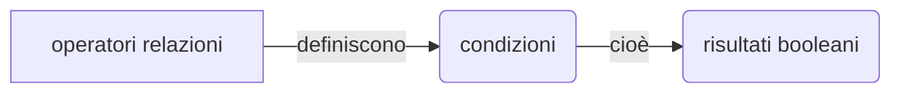

# Lezione 9

## Indice

- [Parliamo degli opeartori su Python ](#python)
- [Una distinzione tra for e while](#confronto-tra-for-e-while)
- [I Vettori](vettori.py)
- [Le operazioni base di un DB](#le-crud)
- [La funzione SPLIT](#la-funznione-split)
- [Usando i JSON](#usando-i-json)

## Python

### Operatori

Gli operatori si dividono in **Operatori Aritmetici**, **Relazionali** e **Logici**.

- op. Aritmetici

  - \+ \- \* \/ % \*\*

- op. Relazionali:

  - == <= >= < > !=

- op. Logici:

  - and or not
  - && || !

- op. unari:

  - += -=
  - counter += 1
    (incremento)
  - counter += n
    (totalizzatore)



### Confronto tra For e While

La discriminante principale nella scelta tra il tipo di **loop** sta nella condizone del: se il numero di volte il loop si ripeterà è difinito, allora si sceglie il **for**, altrimenti il **while**.

La sinstassi del for in python è al seguente: _for_, variabile, _in_, range, _:_.

```python
for x in range(n):
    # operazioni

for x in range(start, end, step):
    # operazioni
```

Lo _start_ è il punto di inizio, l'_end_ è il punto di fine del range (escluso), lo _step_ è di quanto si deve incrementare la variabile _x_ per ogni iterazione. I tre parametri vengono calcolati una sola volta all'inizio del primo ciclo.

[Alcuni es sul ciclo for](lectio9.md)

### Gli Array

Gli array sono una sequenza di dati uguali divisi in celle. In **Python** si dichiarono tramite `[]` e rappresenta un array associativo.

```python
numeri = [12,23,4]
print(numeri)

>> [12,23,4]
```

[Esercizi ed esempi sui Vettori](vettori.py)

### Le CRUD

- C - create/insert
- R - read/prendi tramite query
- U - update
- D - delete

Una volta provati i vettori possimao andare avanti e provare a creare un bel mini gestionale. Quindi [qui](gestionale.py) trovi un gestionale.py che:

Crare un sisitema che _gestisce_ una piccola banca dati avente nome congome CF e città, e si implementano la _C_ e la _D_.

Le possibili azioni in questo gestionale sono: l'inseirmento di un utente e la lettura degli utenti salvati, oltre l'usicta.

### La Funznione Split

una visione piu dettagliata riguardo split su python [qui](split.py)

### Usando i Json

```mermaid
flowchart RL

```

<!-- -->

<!-- -->

<!-- -->

<!-- -->

$
\lim\limits_{x \to \infty} \exp^x = 0
$

$$
\lim\limits_{x \to \infty} \exp^x = 0
$$

$$
50 \text{ mele} \times 100\text{ mostri}
$$

```math
\lim\limits_{x \to \infty} \exp^x = 0
```
