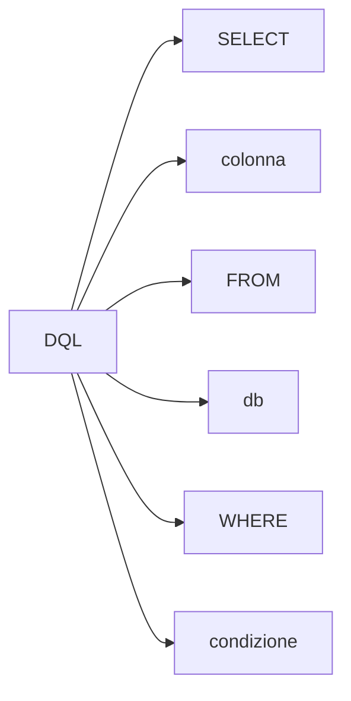

## Gli schemi con coso per i tipi di query

<details>
<summary>da correggere</symmary>

<div style="display: flex; gap: 20px;">

  <div>
    ```mermaid
        graph LR
            step1[ DDL ] --> step2[ CREATE ]

            step1[ DDL ] --> step3[ ALTER ]
            step1[ DDL ] --> step4[ DELETE ]
    ```

  </div>

  <div>
    ```mermaid
        graph LR
            step1[ SQL ] --> step2[ DDL]
            step1[ SQL ] --> step3[ DML]
            step1[ SQL ] --> step4[ DQL]
    ```
  </div>
  <div>
  </div>

</div>



</details>
