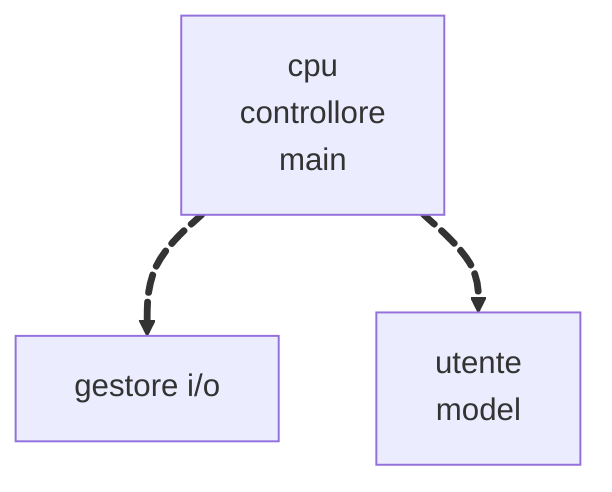

# Lezione 29 del 18/06/2025

## Indice

1. [html](#i-div-pt2)
   1. [DIV](#i-div-pt2)
   2. [bootstrap](#la-griglia-di-bootstrap)
2. [Java](#java)
   1. [intro](#cosè-un-lingauggio-di-programamzione)
   2. []

## I Div pt.2

è un elemento html che permette di prendere una porzione del body e creare una struttura. ci posso inserire qualsiasi cosa.

1. Presi degli elementi block level e messi in un contenitore, dicendo che è `frex`, si possono mettere allineare

## La Griglia di Bootstrap

#### Il Mockup di bootstrap

bootstrap ci mette a disposizione un container, una classe predefinita fatta di 6 righe e massimo 12 colonne. Ogni olonna è 8.33 %, le righe variano in base all'uso. Ci mette a disposizione anche delle classi colonna Col-sm-4, dove sm ci dice che sarà small, lg large e così via. Il nuemro fa riferimento all numero di colonne prese in considerazione.

Notiamo che scriviamo le classi container, row, col-lg md sm n, dalla piu grande alla piu piccola. Le piu piccole sono piu importanti perche si riferiscono ai dispositivi smartphone.

## Java

#### Cos'è un lingauggio di programamzione

E' un lignuaggio capace di scivere programmi. quindi devi avere degli strumenti.

differneza tra linguaggi compilati interpretati e ibridi: complessita, velocità, accuratezza
java vs c#

#### Compilati Interpretati Ibridi

#### Paradigma a Oggetti

#### Design Pattern: MVC

#### Tipi di Dati

##### Primitivi

8

byte char short int long float double boolean

##### Refenziati/Non Primitivi/Oggetto

String
...

---

