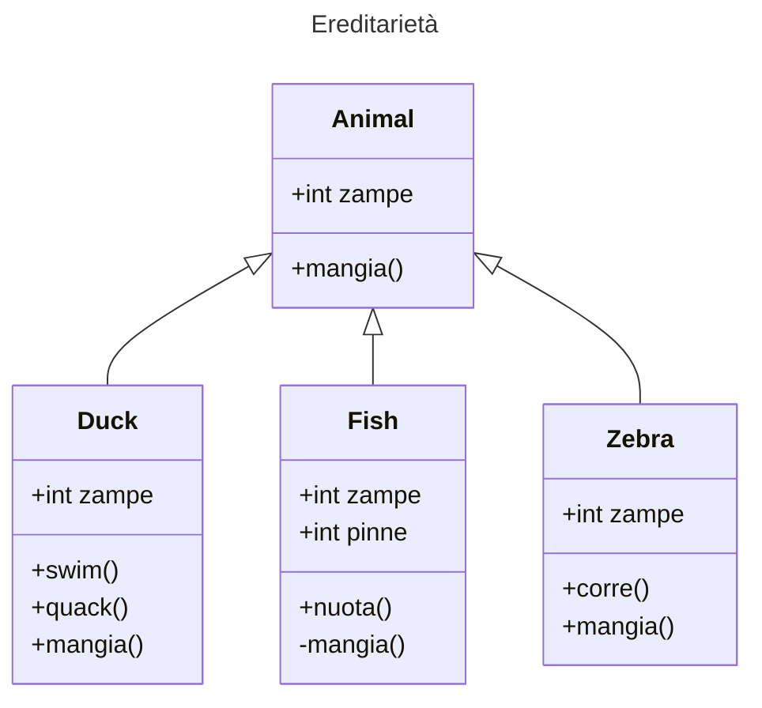

# Lezione 33 del 25/06/2025

## Indice

1. [Progetto mattutino](#progetto-mattutino)
2. [Ereditarietà](#ereditarietà)
3. [Interfaccie](#interfacce)

## Progetto Mattutino

...

## Ereditarietà

_La capacità di una oggetto X di tramandare le proprie caratteristiche e comportmaenti a un altro oggetto Y._

Gli oggetti in questione sono le _Classi_ in Java, le _Caratteristiche_ e i _Comportamenti_ sono gli _Attributi_ della classe e i suoi _Metodi_.

Come si vede dal ClassDiagram la classe Animal è padre delle classi Duck Fish e Zebra, e loro sono figli di Animal. La relazione di padre/figlio concede ai figli i metodi e gli attributi publici.

## Classi Astratte

`public abstarc class Animale{}` in Java si usa per rappresentare un'astrazione di una classe che non può essere istanziabile ma tramanda delle caratteristiche e dei comportamenti

## Interfacce
